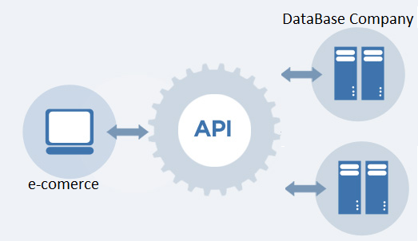

# TechChallengeApplication

We have an e-commerce in one side and in other side I have a physical company that sells the products. This API is between of two sides acting as an intermediary between the customer and the company. The API would be responsible for the integration of the e-commerce.

## Installation

Import as a Java Project and configure the folder lib in classpath

## Development setup

The unit tests are in ClientTest.java

## Meta

– Leonardo Pache
